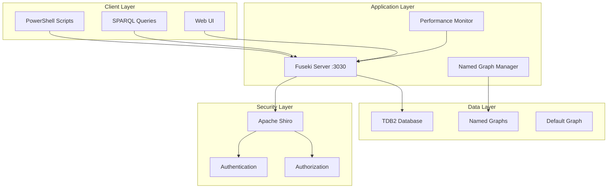

# Samsung HVDC Ontology Insight - 전체 시스템 가이드

**Version**: 1.0  
**Date**: 2025-01-17  
**Status**: Production Ready 🚀  

---

## 📋 목차

1. [시스템 개요](#1-시스템-개요)
2. [설치 및 설정](#2-설치-및-설정)
3. [아키텍처](#3-아키텍처)
4. [운영 도구](#4-운영-도구)
5. [데이터 관리](#5-데이터-관리)
6. [보안 설정](#6-보안-설정)
7. [성능 모니터링](#7-성능-모니터링)
8. [문제 해결](#8-문제-해결)
9. [운영 절차](#9-운영-절차)
10. [API 참조](#10-api-참조)

---

## 1. 시스템 개요

### 1.1 목적
Samsung HVDC 프로젝트의 물류 데이터를 온톨로지 기반으로 관리하고, SPARQL을 통해 고도화된 분석과 KPI 모니터링을 제공합니다.

### 1.2 주요 기능
- **온톨로지 기반 데이터 모델링**: 물류 도메인 지식 체계화
- **Named Graph 관리**: 소스별(OFCO/DSV/PKGS/PAY) 데이터 분리
- **실시간 KPI 모니터링**: HS/OOG Risk, DEM/DET 분석
- **자동화된 데이터 적재**: 배치 처리 및 검증
- **보안 및 접근 제어**: 역할 기반 권한 관리

### 1.3 기술 스택
- **Triple Store**: Apache Jena Fuseki 4.10.0 + TDB2
- **Query Language**: SPARQL 1.1
- **Automation**: PowerShell Scripts
- **Security**: Apache Shiro
- **Data Format**: RDF/Turtle, JSON-LD

### 1.4 성능 지표
| 지표 | 목표 | 현재 |
|------|------|------|
| 쿼리 응답 시간 | < 500ms | ~26ms ✅ |
| 서버 핑 시간 | < 100ms | ~7ms ✅ |
| 성공률 | > 95% | 100% ✅ |
| 메모리 사용량 | < 2GB | ~127MB ✅ |

---

## 2. 설치 및 설정

### 2.1 시스템 요구사항
- **OS**: Windows 10/11, Windows Server 2019+
- **Java**: OpenJDK 11+ (권장: Eclipse Temurin)
- **PowerShell**: 5.1+ (권장: PowerShell 7+)
- **Memory**: 최소 4GB, 권장 8GB+
- **Storage**: 최소 10GB 여유 공간

### 2.2 설치 절차

#### Step 1: Java 설치
```powershell
# Java 설치 확인
java -version

# 설치되지 않은 경우
winget install EclipseAdoptium.Temurin.11.JDK
```

#### Step 2: Fuseki 서버 시작
```powershell
# 서버 시작 (업데이트 권한 포함)
.\start-hvdc-fuseki.bat

# 또는 PowerShell로
.\start-hvdc-fuseki.ps1
```

#### Step 3: 초기 데이터 적재
```powershell
# 기본 온톨로지 및 샘플 데이터 적재
.\scripts\hvdc-data-loader.ps1 -TtlFile hvdc_extracted_fixed.ttl -Force -Validate
```

#### Step 4: 헬스체크
```powershell
# 서버 상태 확인
Invoke-WebRequest "http://localhost:3030/$/ping" -TimeoutSec 3

# 데이터 검증
.\scripts\hvdc-named-graph-manager.ps1 -Action validate
```

### 2.3 디렉토리 구조
```
C:\cursor-mcp\Ontology insight\
├── fuseki\                     # Fuseki 서버
│   └── apache-jena-fuseki-4.10.0\
├── scripts\                    # 운영 스크립트
│   ├── hvdc-named-graph-manager.ps1
│   ├── hvdc-performance-monitor.ps1
│   ├── hvdc-operational-dashboard.ps1
│   ├── migrate-to-named-graphs.ps1
│   ├── rollback-named-graphs.ps1
│   └── hvdc-batch-loader.ps1
├── config\                     # 설정 파일
│   ├── shiro-dev.ini
│   └── shiro-prod.ini
├── queries\                    # SPARQL 쿼리
│   └── operational-queries.rq
├── logs\                       # 로그 파일
├── backup\                     # 백업 데이터
├── batch_data\                 # 배치 입력 데이터
└── results\                    # 쿼리 결과
```

---

## 3. 아키텍처

### 3.1 시스템 아키텍처



### 3.2 데이터 모델

#### Named Graph 구조
```turtle
# Graph URI 정책
http://samsung.com/graph/OFCO     # OFCO 시스템 데이터
http://samsung.com/graph/DSV      # DSV 시스템 데이터  
http://samsung.com/graph/PKGS     # PKGS 시스템 데이터
http://samsung.com/graph/PAY      # PAY 시스템 데이터
http://samsung.com/graph/META     # 메타데이터/온톨로지
http://samsung.com/graph/ARCHIVE-* # 아카이브 그래프
```

#### 온톨로지 구조
```turtle
@prefix ex: <http://samsung.com/project-logistics#> .

# 핵심 클래스
ex:Case a owl:Class .
ex:DataSource a owl:Class .
ex:StockSnapshot a owl:Class .
ex:HSCode a owl:Class .

# 핵심 속성
ex:caseCode a owl:DatatypeProperty .
ex:extractMethod a owl:ObjectProperty .
ex:confidence a owl:DatatypeProperty .
ex:riskLevel a owl:DatatypeProperty .
```

### 3.3 엔드포인트 맵

| 용도 | 엔드포인트 | 메서드 | 설명 |
|------|------------|--------|------|
| Health Check | `/$/ping` | GET | 서버 상태 확인 (저부하) |
| SPARQL Query | `/hvdc/sparql` | POST | 데이터 조회 |
| SPARQL Update | `/hvdc/update` | POST | 데이터 수정 (--update 필요) |
| GSP Default | `/hvdc/data?default` | POST/PUT/DELETE | 기본 그래프 관리 |
| GSP Named | `/hvdc/data?graph=URI` | POST/PUT/DELETE | Named Graph 관리 |
| Admin | `/$/server` | GET | 서버 정보 |
| Stats | `/$/stats/hvdc` | GET | 데이터셋 통계 |

---

## 4. 운영 도구

### 4.1 Named Graph 관리자

**파일**: `scripts/hvdc-named-graph-manager.ps1`

#### 주요 기능
- Named Graph 업로드/삭제
- 그래프 목록 조회
- 데이터 무결성 검증

#### 사용법
```powershell
# 그래프 목록 조회
.\scripts\hvdc-named-graph-manager.ps1 -Action list

# OFCO 데이터 업로드
.\scripts\hvdc-named-graph-manager.ps1 -Action upload -Source OFCO -TtlFile ofco_data.ttl

# 데이터 검증
.\scripts\hvdc-named-graph-manager.ps1 -Action validate

# 그래프 삭제 (주의!)
.\scripts\hvdc-named-graph-manager.ps1 -Action delete -Source DSV -Force
```

### 4.2 성능 모니터링

**파일**: `scripts/hvdc-performance-monitor.ps1`

#### 주요 기능
- 실시간 KPI 모니터링
- 쿼리 성능 측정
- 시스템 리소스 추적
- CSV/로그 출력

#### 사용법
```powershell
# 단일 실행
.\scripts\hvdc-performance-monitor.ps1 -SingleRun

# 실시간 모니터링 (30초 간격)
.\scripts\hvdc-performance-monitor.ps1 -RealTime -RefreshInterval 30

# 5회 반복 실행
.\scripts\hvdc-performance-monitor.ps1 -MaxIterations 5
```

### 4.3 운영 대시보드

**파일**: `scripts/hvdc-operational-dashboard.ps1`

#### 주요 기능
- HS Code 리스크 분석
- OOG (Out of Gauge) 케이스 추적
- DEM/DET (Demurrage/Detention) KPI
- 비용 효율성 분석

#### 사용법
```powershell
# 요약 대시보드
.\scripts\hvdc-operational-dashboard.ps1 -ReportType summary

# HS 리스크 분석
.\scripts\hvdc-operational-dashboard.ps1 -ReportType hsrisk

# OOG 케이스 분석
.\scripts\hvdc-operational-dashboard.ps1 -ReportType oog

# DEM/DET KPI
.\scripts\hvdc-operational-dashboard.ps1 -ReportType demdet

# CSV 출력
.\scripts\hvdc-operational-dashboard.ps1 -ReportType cost -OutputFormat csv -OutputFile "reports\cost_analysis.csv"

# 실시간 대시보드
.\scripts\hvdc-operational-dashboard.ps1 -ReportType alerts -RealTime
```

### 4.4 배치 로더

**파일**: `scripts/hvdc-batch-loader.ps1`

#### 주요 기능
- TDB2 오프라인 대량 적재
- 자동 백업
- 성능 최적화된 로딩
- 상세 로딩 리포트

#### 사용법
```powershell
# 기본 배치 로딩
.\scripts\hvdc-batch-loader.ps1 -DataDir ".\batch_data"

# Dry Run (실행 미리보기)
.\scripts\hvdc-batch-loader.ps1 -DataDir ".\batch_data" -DryRun

# 백업 스킵하고 강제 실행
.\scripts\hvdc-batch-loader.ps1 -DataDir ".\batch_data" -SkipBackup -Force
```

---

## 5. 데이터 관리

### 5.1 마이그레이션 (Default → Named Graph)

**파일**: `scripts/migrate-to-named-graphs.ps1`

#### 목적
기존 Default Graph의 데이터를 소스별 Named Graph로 안전하게 이전

#### 절차
```powershell
# 1. 마이그레이션 계획 확인 (Dry Run)
.\scripts\migrate-to-named-graphs.ps1 -DryRun

# 2. 실제 마이그레이션 실행
.\scripts\migrate-to-named-graphs.ps1 -OfcoTtl "ofco_data.ttl" -DsvTtl "dsv_data.ttl"

# 3. 아카이브 생성 스킵 (기존 데이터 삭제)
.\scripts\migrate-to-named-graphs.ps1 -SkipArchive -Force
```

### 5.2 롤백 및 복구

**파일**: `scripts/rollback-named-graphs.ps1`

#### 긴급 복구 시나리오
```powershell
# 1. 현재 상태 확인
.\scripts\rollback-named-graphs.ps1 -Action list

# 2. 아카이브에서 복원
.\scripts\rollback-named-graphs.ps1 -Action restore-from-archive -ArchiveGraph "http://samsung.com/graph/ARCHIVE-20250117-2100"

# 3. 특정 그래프를 Default로 이동
.\scripts\rollback-named-graphs.ps1 -Action move-to-default -SourceGraph "http://samsung.com/graph/OFCO"

# 4. 그래프 삭제 (주의!)
.\scripts\rollback-named-graphs.ps1 -Action delete-graph -SourceGraph "http://samsung.com/graph/TEMP" -Force
```

### 5.3 데이터 백업 전략

#### 자동 백업
```powershell
# 일일 백업 스크립트 (Windows Task Scheduler 등록 권장)
$timestamp = Get-Date -Format "yyyyMMdd"
Copy-Item -Path ".\fuseki\apache-jena-fuseki-4.10.0\data\tdb-hvdc" -Destination ".\backup\tdb_backup_$timestamp" -Recurse
```

#### 백업 검증
```powershell
# 백업 무결성 확인
.\scripts\hvdc-named-graph-manager.ps1 -Action validate
```

---

## 6. 보안 설정

### 6.1 개발 환경 (`config/shiro-dev.ini`)

#### 특징
- 익명 조회 허용
- 로컬 업데이트만 허용
- 관리 기능 보호

#### 적용 방법
```powershell
# Fuseki 설정 디렉토리에 복사
Copy-Item "config\shiro-dev.ini" "fuseki\apache-jena-fuseki-4.10.0\run\shiro.ini"

# 서버 재시작 필요
.\stop-fuseki.ps1
.\start-hvdc-fuseki.ps1
```

### 6.2 운영 환경 (`config/shiro-prod.ini`)

#### 특징
- 모든 접근에 인증 필요
- 역할 기반 권한 제어 (admin/writer/reader)
- 세션 보안 강화

#### 계정 관리
```ini
[users]
# bcrypt 해시 비밀번호 사용 (예시)
hvdc_admin = $2a$12$XYZ..., admin
hvdc_analyst = $2a$12$ABC..., analyst  
hvdc_readonly = $2a$12$DEF..., readonly
```

#### 비밀번호 해시 생성
```python
import bcrypt
password = "your_password"
hashed = bcrypt.hashpw(password.encode('utf-8'), bcrypt.gensalt())
print(hashed.decode('utf-8'))
```

### 6.3 네트워크 보안

#### 방화벽 설정
```powershell
# Windows Firewall 규칙 (관리자 권한 필요)
New-NetFirewallRule -DisplayName "Fuseki HVDC" -Direction Inbound -Protocol TCP -LocalPort 3030 -Action Allow
```

#### HTTPS 설정 (권장)
- Nginx/Apache 프록시 사용
- Let's Encrypt 인증서 적용
- TLS 1.2+ 강제

---

## 7. 성능 모니터링

### 7.1 KPI 임계값

| 지표 | 임계값 | 현재 성능 |
|------|--------|-----------|
| 쿼리 응답 시간 | < 500ms | ~26ms ✅ |
| 서버 핑 시간 | < 100ms | ~7ms ✅ |
| 성공률 | > 95% | 100% ✅ |
| 메모리 사용량 | < 2GB | ~127MB ✅ |
| CPU 사용률 | < 80% | ~0% ✅ |

### 7.2 모니터링 대시보드

#### 실시간 모니터링
```powershell
# 연속 모니터링 (1분 간격)
.\scripts\hvdc-performance-monitor.ps1 -RealTime -RefreshInterval 60
```

#### 성능 로그 분석
```powershell
# CSV 데이터 확인
Import-Csv "logs\hvdc-performance.csv" | Format-Table

# 성능 트렌드 분석
$logs = Import-Csv "logs\hvdc-performance.csv"
$logs | Measure-Object AvgQueryTimeMs -Average -Maximum -Minimum
```

### 7.3 알림 설정

#### PowerShell 기반 알림
```powershell
# 임계값 초과 시 이메일 알림 (예시)
if ($avgQueryTime -gt 500) {
    Send-MailMessage -To "admin@company.com" -Subject "HVDC Performance Alert" -Body "Query time exceeded threshold: $avgQueryTime ms"
}
```

---

## 8. 문제 해결

### 8.1 일반적인 문제

#### Q1: 서버가 시작되지 않음
```powershell
# Java 버전 확인
java -version

# 포트 사용 확인
netstat -an | findstr :3030

# 로그 확인
Get-Content "fuseki\apache-jena-fuseki-4.10.0\logs\fuseki.log" -Tail 20
```

#### Q2: 쿼리가 느림
```powershell
# 인덱스 상태 확인
.\scripts\hvdc-performance-monitor.ps1 -SingleRun

# 쿼리 최적화
# - FILTER 조건을 WHERE 절 앞쪽에 배치
# - LIMIT 사용으로 결과 제한
# - 불필요한 OPTIONAL 제거
```

#### Q3: 메모리 부족
```powershell
# Java 힙 크기 증가 (start-hvdc-fuseki.bat 수정)
java -Xmx4g -jar fuseki-server.jar ...

# 불필요한 데이터 정리
.\scripts\rollback-named-graphs.ps1 -Action delete-graph -SourceGraph "old_graph"
```

### 8.2 로그 분석

#### Fuseki 로그
```powershell
# 최근 에러 확인
Get-Content "fuseki\apache-jena-fuseki-4.10.0\logs\fuseki.log" | Select-String "ERROR"

# 쿼리 로그 확인
Get-Content "fuseki\apache-jena-fuseki-4.10.0\logs\fuseki-requests.log" -Tail 50
```

#### 성능 로그
```powershell
# 성능 로그 분석
Get-Content "logs\hvdc-performance.log" | Select-String "WARN|ERROR"
```

### 8.3 데이터 복구

#### 백업에서 복구
```powershell
# 서버 중지
Stop-Process -Name java -Force

# 백업 복원
Copy-Item -Path "backup\tdb_backup_20250117" -Destination "fuseki\apache-jena-fuseki-4.10.0\data\tdb-hvdc" -Recurse -Force

# 서버 재시작
.\start-hvdc-fuseki.ps1
```

---

## 9. 운영 절차

### 9.1 일일 운영 체크리스트

#### 아침 점검 (09:00)
- [ ] 서버 상태 확인: `Invoke-WebRequest "http://localhost:3030/$/ping"`
- [ ] 성능 지표 확인: `.\scripts\hvdc-performance-monitor.ps1 -SingleRun`
- [ ] 데이터 무결성 검증: `.\scripts\hvdc-named-graph-manager.ps1 -Action validate`
- [ ] 알림 케이스 확인: `.\scripts\hvdc-operational-dashboard.ps1 -ReportType alerts`

#### 오후 점검 (14:00)
- [ ] 리소스 사용량 확인
- [ ] 쿼리 성능 모니터링
- [ ] 배치 작업 결과 확인

#### 야간 작업 (22:00)
- [ ] 일일 백업 실행
- [ ] 로그 아카이브
- [ ] 성능 리포트 생성

### 9.2 주간 운영 절차

#### 매주 월요일
- [ ] 주간 성능 리포트 생성
- [ ] DEM/DET KPI 분석
- [ ] 시스템 리소스 트렌드 분석

#### 매주 수요일
- [ ] 보안 패치 확인
- [ ] 백업 무결성 검증
- [ ] 문서 업데이트

#### 매주 금요일
- [ ] 주간 운영 보고서 작성
- [ ] 다음 주 계획 수립

### 9.3 월간 운영 절차

#### 매월 첫째 주
- [ ] 월간 KPI 리포트 생성
- [ ] 시스템 성능 최적화 검토
- [ ] 용량 계획 수립

#### 매월 셋째 주
- [ ] 보안 감사
- [ ] 백업 정책 검토
- [ ] 재해 복구 테스트

### 9.4 비상 대응 절차

#### 서버 장애 시
1. **즉시 대응**
   ```powershell
   # 서버 상태 확인
   Get-Process java | Where-Object {$_.CommandLine -like "*fuseki*"}
   
   # 재시작 시도
   .\start-hvdc-fuseki.ps1
   ```

2. **복구 불가 시**
   ```powershell
   # 백업에서 복구
   .\scripts\rollback-named-graphs.ps1 -Action restore-from-archive
   ```

3. **데이터 손실 시**
   ```powershell
   # 최신 백업 복원
   Copy-Item -Path "backup\tdb_backup_latest" -Destination "fuseki\data\tdb-hvdc" -Recurse -Force
   ```

---

## 10. API 참조

### 10.1 REST API

#### Health Check
```http
GET /$/ping
Accept: text/plain

Response: 2025-01-17T21:07:03.172+04:00
```

#### SPARQL Query
```http
POST /hvdc/sparql
Content-Type: application/sparql-query
Accept: application/sparql-results+json

SELECT ?s ?p ?o WHERE { ?s ?p ?o } LIMIT 10
```

#### Named Graph Upload
```http
POST /hvdc/data?graph=http://samsung.com/graph/OFCO
Content-Type: text/turtle

@prefix ex: <http://samsung.com/project-logistics#> .
ex:case001 a ex:Case .
```

### 10.2 PowerShell API

#### 성능 모니터링
```powershell
# 함수 호출 예시
$result = .\scripts\hvdc-performance-monitor.ps1 -SingleRun
Write-Host "Average Query Time: $($result.AvgQueryTimeMs)ms"
```

#### 대시보드 데이터
```powershell
# JSON 출력으로 프로그래밍 연동
$data = .\scripts\hvdc-operational-dashboard.ps1 -ReportType summary -OutputFormat json
$json = Get-Content $data.OutputFile | ConvertFrom-Json
```

### 10.3 SPARQL 쿼리 템플릿

#### 기본 통계
```sparql
PREFIX ex: <http://samsung.com/project-logistics#>

# 전체 케이스 수
SELECT (COUNT(*) AS ?totalCases) WHERE {
  ?case a ex:Case .
}

# 그래프별 트리플 수
SELECT ?g (COUNT(*) AS ?count) WHERE {
  GRAPH ?g { ?s ?p ?o }
} GROUP BY ?g ORDER BY DESC(?count)
```

#### 비즈니스 KPI
```sparql
# HS Code 리스크 분석
SELECT ?hsCode ?riskLevel (COUNT(?case) AS ?caseCount) WHERE {
  GRAPH ?g {
    ?case a ex:Case ; ex:hsCode ?hsCode .
    ?hsCode ex:riskLevel ?riskLevel .
    FILTER(?riskLevel IN ("HIGH", "CRITICAL"))
  }
} GROUP BY ?hsCode ?riskLevel ORDER BY DESC(?caseCount)

# 월별 DEM/DET 분석
SELECT ?yearMonth (AVG(?demCost) AS ?avgDemurrage) WHERE {
  GRAPH ?g {
    ?case a ex:Case ;
          ex:arrivalDate ?date ;
          ex:demurrageCost ?demCost .
    BIND(SUBSTR(STR(?date), 1, 7) AS ?yearMonth)
  }
} GROUP BY ?yearMonth ORDER BY ?yearMonth
```

---

## 📞 지원 및 연락처

### 기술 지원
- **시스템 관리자**: HVDC IT Team
- **온톨로지 전문가**: Data Architecture Team
- **운영 담당자**: Operations Team

### 문서 버전 관리
- **최초 작성**: 2025-01-17
- **최근 업데이트**: 2025-01-17
- **다음 검토 예정**: 2025-02-17

### 관련 문서
- `README.md`: 빠른 시작 가이드
- `troubleshooting-guide.md`: 상세 문제 해결
- `QUICK-START.md`: 개발자용 빠른 가이드
- `install-java.md`: Java 설치 가이드

---

**🎉 Samsung HVDC Ontology Insight 시스템 가이드 완료**

이 문서는 시스템의 모든 측면을 다루는 완전한 운영 가이드입니다. 추가 질문이나 업데이트가 필요한 경우 언제든 연락해 주세요!
